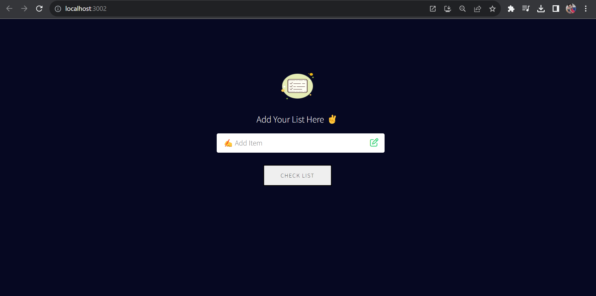
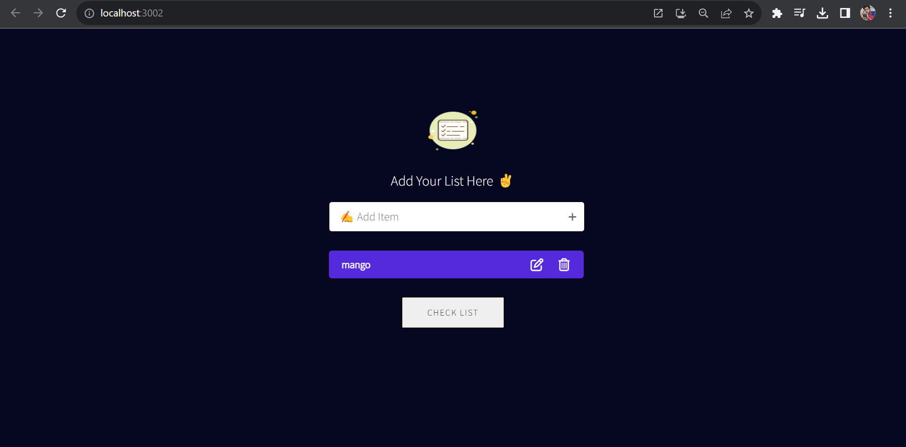
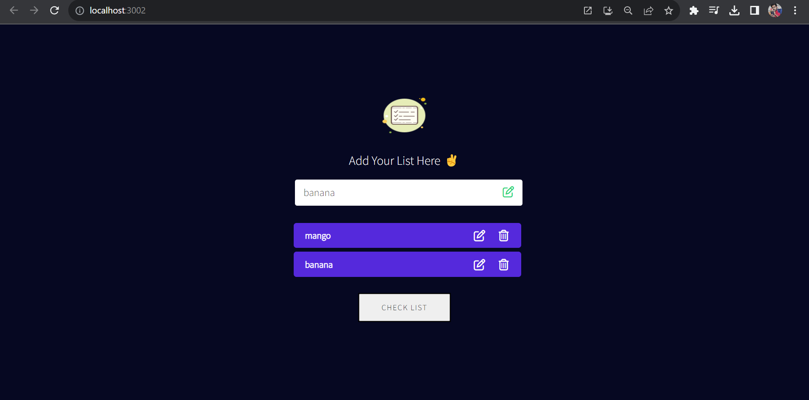

# React Todo List App



## Description

"The React Todo List App is a versatile task management tool designed to simplify your daily activities. With this application, you can effortlessly create, delete, and edit tasks, ensuring that your to-do list remains organized and up-to-date.

What sets this app apart is its seamless integration of local storage. Your tasks are not only accessible while online but are also securely stored on your device using local storage. This means you can trust that your tasks will persist even when you're offline or when you close the app.

Whether you need to jot down quick reminders, manage complex projects, or simply keep track of your daily chores, the React Todo List App provides a user-friendly and efficient solution. It's time to take control of your tasks and experience the convenience of local storage-powered task management!"

## Features

- **Add Tasks:** Easily add new tasks with a title and optional description.

- **Edit Tasks:** Update task details, such as the title or description, as needed.

- **Delete Tasks:** Remove individual tasks or clear the entire list at once.

- **Local Storage:** Tasks are saved locally on the user's computer, providing persistence between sessions.

## Technologies Used

- **React.js:** The app's frontend is built using the React.js library, enabling a dynamic and responsive user interface.

- **Local Storage API:** Utilized to store and retrieve tasks locally on the user's device.

- **HTML5/CSS3:** Used for structuring and styling the app's interface.

## Screenshots




## Installation

Follow these steps to set up the project locally:

1. Clone the repository:

   ```bash
   git clone https://github.com/your-username/react-todo-list.git
   ```

   cd react-todo-list
   npm install
   npm start
   Open your web browser and go to http://localhost:3000.

You can now use the React Todo List App to manage your tasks.

Contributing
We welcome contributions from the community to enhance the project. To contribute:

Fork the repository.

Create a new branch:
git checkout -b feature/your-feature-name
git commit -m 'Add some feature'

git push origin feature/your-feature-name
Create a pull request on the original repository.

License
This project is licensed under the MIT License. See the LICENSE file for details. Veeral Kansara.

Contact
If you have any questions, suggestions, or issues, please feel free to contact us at vkveeral@gmail.com

Happy task management!
